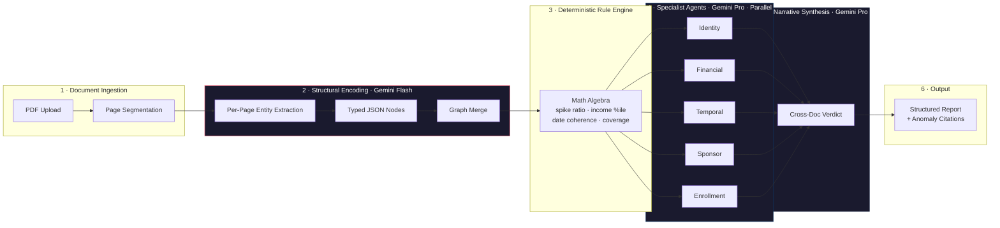
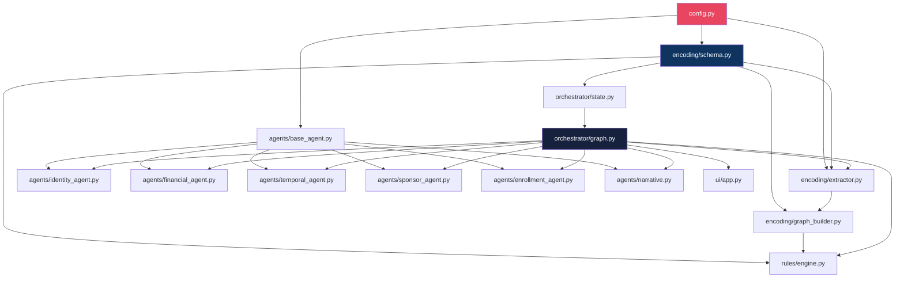
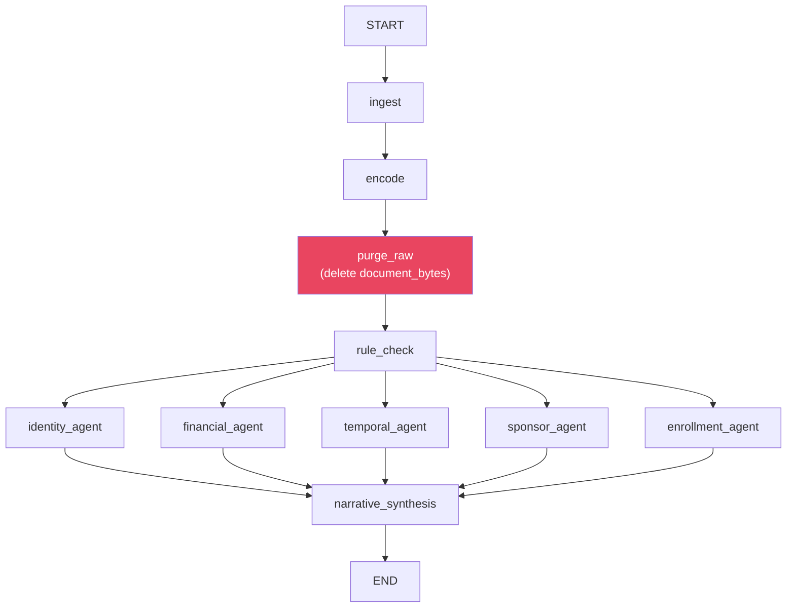

# Uplan PoC — Adversarial Immigration Document Intelligence

> **Scope**: Hackathon proof-of-concept. No fine-tuning. No production deployment.
> **Goal**: Demonstrate structural encoding → typed semantic graph → parallel specialist reasoning → adversarial narrative synthesis as a viable architecture for immigration document intelligence.

---

## Navigation Checkpoint

### Data / Model Pipeline



### File Dependency Tree

```
uplan/                                        # Root package
├── config.py                                 # Vertex AI client init, model names, thresholds
├── requirements.txt
├── .env.example
│
├── encoding/                                 # Structural Encoding Layer
│   ├── __init__.py
│   ├── schema.py                             # Pydantic models for all 5 node types + graph
│   ├── extractor.py                          # Gemini Flash: per-page typed entity extraction
│   └── graph_builder.py                      # Merge per-page nodes → global semantic graph
│
├── rules/                                    # Deterministic Rule Engine
│   ├── __init__.py
│   └── engine.py                             # Pure-math algebra on graph nodes (no LLM)
│
├── orchestrator/                             # LangGraph Orchestration
│   ├── __init__.py
│   ├── state.py                              # TypedDict state schema for LangGraph
│   └── graph.py                              # StateGraph: ingest→encode→rules→agents→synth→purge
│
├── agents/                                   # Specialist Agents (Gemini Pro)
│   ├── __init__.py
│   ├── base_agent.py                         # Abstract base: call Gemini Pro, return structured finding
│   ├── identity_agent.py                     # Name variant, transliteration, cross-doc match
│   ├── financial_agent.py                    # Balance trend, spike analysis, income coherence
│   ├── temporal_agent.py                     # Date range, employment gaps, visa overlap
│   ├── sponsor_agent.py                      # Sponsor income, relationship, jurisdiction
│   ├── enrollment_agent.py                   # Institution, program cost, funds coverage
│   └── narrative.py                          # Cross-doc synthesis: final verdict + citations
│
├── security/                                 # Lobster Trap Integration (Phase 2)
│   ├── __init__.py
│   ├── proxy_client.py                       # Rewrites Gemini base_url → Lobster Trap
│   └── rules/
│       └── policy.yaml                       # YAML: DENY PII in plaintext, LOG financial nodes
│
└── ui/                                       # Streamlit Frontend
    ├── app.py                                # Entrypoint: file upload, orchestrator call, report
    └── components.py                         # Report rendering, anomaly cards, graph viz
```

#### Import Dependency Graph



---

## User Review Required

> [!IMPORTANT]
> **Vertex AI Authentication**: The plan assumes you have a GCP project with Vertex AI API enabled and Application Default Credentials configured (`gcloud auth application-default login`). Confirm your **GCP project ID** and preferred **region** (e.g., `us-central1`).

> [!IMPORTANT]
> **Model Selection**: The plan uses `gemini-2.0-flash` for extraction (speed, cost) and `gemini-2.5-pro` for reasoning (quality). Confirm these are available in your Vertex AI project, or specify alternatives.

> [!WARNING]
> **Lobster Trap is Phase 2**: Per your instruction, Lobster Trap integration is deferred. The `security/` module will be scaffolded but not wired into the main pipeline. All Gemini calls go direct to Vertex AI in Phase 1.

---

## Open Questions

> [!IMPORTANT]
> **1. Test Documents**: Do you have sample immigration PDFs (bank statements, passports, sponsor letters) for end-to-end testing? Or should I create synthetic test fixtures with mock data?

> [!IMPORTANT]
> **2. Streamlit vs. other UI**: You mentioned "Streamlit / Next.js" in the layers. For a hackathon PoC, Streamlit is faster to ship. Should I go with Streamlit, or do you want a Next.js frontend for the demo?

> [!IMPORTANT]
> **3. ChromaDB BYOG RAG**: The BYOG policy store (immigration policy PDFs for RAG) — should this be included in the PoC scope, or is it sufficient to hardcode jurisdiction-specific thresholds in the rule engine for the demo?

---

## Proposed Changes

### Component 1: Config & Environment

#### [NEW] [config.py](file:///c:/Users/ksk76/Downloads/uplan-hackathon-space-amd/refined/new-plan/config.py)

Central configuration module. Initializes the `google.genai.Client` with `vertexai=True`.

```python
# Code Status: Production-Ready Template
from google import genai

client = genai.Client(
    vertexai=True,
    project=os.environ["GCP_PROJECT_ID"],
    location=os.environ.get("GCP_LOCATION", "us-central1"),
)

FLASH_MODEL = "gemini-2.0-flash"   # Extraction pass
PRO_MODEL   = "gemini-2.5-pro"     # Reasoning pass
```

Key decisions:
- Single `client` instance, imported by all modules
- Model names as constants — easy to swap
- All secrets via env vars (`.env` + `python-dotenv`)

#### [NEW] [requirements.txt](file:///c:/Users/ksk76/Downloads/uplan-hackathon-space-amd/refined/new-plan/requirements.txt)

```
google-genai>=1.14.0
langgraph>=0.4.0
pydantic>=2.10
streamlit>=1.45.0
python-dotenv>=1.0.0
PyPDF2>=3.0.0
```

#### [NEW] [.env.example](file:///c:/Users/ksk76/Downloads/uplan-hackathon-space-amd/refined/new-plan/.env.example)

```
GCP_PROJECT_ID=your-project-id
GCP_LOCATION=us-central1
```

---

### Component 2: Encoding Layer (The Core Innovation)

This is the structural encoding pipeline — the heart of Uplan.

#### [NEW] [schema.py](file:///c:/Users/ksk76/Downloads/uplan-hackathon-space-amd/refined/new-plan/encoding/schema.py)

Pydantic models for the typed semantic graph. These are both the extraction schema (Gemini Flash output) AND the reasoning input (Gemini Pro input). This is the contract between layers.

**5 node types + relationship edges + global graph container:**

| Node Type | Key Fields | Anomaly Flags |
|-----------|-----------|---------------|
| `IdentityNode` | `name_variants[]`, `dob`, `nationality`, `passport_no` | `transliteration_flags[]`, `cross_doc_match: bool` |
| `FinancialNode` | `currency`, `avg_monthly_income`, `closing_balance`, `spikes[]` | `unlabeled_deposits: int`, `income_percentile: float \| None` |
| `TemporalNode` | `doc_date_ranges[]`, `employment_start/end`, `visa_window` | `gap_flags[]`, `chronology_valid: bool` |
| `SponsorNode` | `declared_income`, `relationship`, `jurisdiction` | `income_supports_coverage: bool`, `doc_authenticity_score` |
| `EnrollmentNode` | `institution`, `program_cost`, `duration_months` | `funds_cover_full_stay: bool`, `coe_date_matches_visa: bool` |

The graph container:
```python
class SemanticGraph(BaseModel):
    identity: IdentityNode
    financial: FinancialNode
    temporal: TemporalNode
    sponsor: Optional[SponsorNode] = None    # Not all apps have sponsors
    enrollment: Optional[EnrollmentNode] = None  # Not all apps are student visas
    edges: list[GraphEdge]                   # Typed relationships
    token_count: int                         # Track compression ratio
    source_page_count: int                   # Original page count
```

#### [NEW] [extractor.py](file:///c:/Users/ksk76/Downloads/uplan-hackathon-space-amd/refined/new-plan/encoding/extractor.py)

Gemini Flash per-page extraction. Uses `response_schema` with Pydantic models to force structured JSON output.

**Strategy**:
1. Split PDF into page-level byte segments (PyPDF2)
2. For each page: send to Gemini Flash with `types.Part.from_bytes()` + structured output config
3. Return a `list[PageExtraction]` — raw typed nodes per page

```python
# Core extraction call (simplified)
response = client.models.generate_content(
    model=FLASH_MODEL,
    contents=[EXTRACTION_PROMPT, types.Part.from_bytes(data=page_bytes, mime_type="application/pdf")],
    config={
        "response_mime_type": "application/json",
        "response_schema": PageExtraction,
    },
)
page_node: PageExtraction = response.parsed
```

Key design: The extraction prompt instructs the model to extract typed entities, NOT summarize. It explicitly asks for `null` on missing fields (anomaly flags).

#### [NEW] [graph_builder.py](file:///c:/Users/ksk76/Downloads/uplan-hackathon-space-amd/refined/new-plan/encoding/graph_builder.py)

Pure Python merge logic. Takes `list[PageExtraction]` → produces `SemanticGraph`.

- Deduplicates identity nodes across pages (name matching)
- Aggregates financial entries into time-series
- Builds edges based on field co-reference (e.g., income on payslip → deposit on bank statement)
- Computes `token_count` for the final graph JSON
- Sets explicit `null` flags for missing data (no hallucination surface)

---

### Component 3: Deterministic Rule Engine

#### [NEW] [engine.py](file:///c:/Users/ksk76/Downloads/uplan-hackathon-space-amd/refined/new-plan/rules/engine.py)

Pure math. No LLM calls. Operates directly on the typed graph nodes.

**Rules implemented**:

| Rule ID | Check | Formula |
|---------|-------|---------|
| `FIN-001` | Spike ratio | `spike.amount / avg_monthly_income > α` → flag |
| `FIN-002` | Unlabeled deposits | `unlabeled_deposits > 0` → flag |
| `FIN-003` | Income-balance coherence | `abs(declared_income * months - balance_delta) / declared_income > ε` → flag |
| `TMP-001` | Employment gap | `gap_days > δ_warn` → warning, `> δ_crit` → critical |
| `TMP-002` | Chronology | `chronology_valid == False` → critical |
| `IDN-001` | Name mismatch | `cross_doc_match == False` → critical |
| `SPN-001` | Sponsor coverage | `income_supports_coverage == False` → critical |
| `ENR-001` | Funds sufficiency | `funds_cover_full_stay == False` → critical |

Output: `list[RuleFinding]` with `rule_id`, `severity`, `field_path`, `expected`, `actual`.

Thresholds (`α`, `ε`, `δ`) are configurable in `config.py` — hardcoded for PoC, RAG-fed later.

---

### Component 4: LangGraph Orchestrator

#### [NEW] [state.py](file:///c:/Users/ksk76/Downloads/uplan-hackathon-space-amd/refined/new-plan/orchestrator/state.py)

LangGraph state schema using `TypedDict` with `Annotated` reducers for parallel agent output merging.

```python
class UplanState(TypedDict):
    # Input
    document_bytes: list[bytes]           # Raw PDF bytes (purged after encoding)
    
    # Encoding output
    semantic_graph: Optional[dict]         # SemanticGraph.model_dump()
    encoding_metadata: Optional[dict]      # Token counts, page counts, timing
    
    # Rule engine output
    rule_findings: Annotated[list[dict], operator.add]
    
    # Agent outputs (parallel merge via operator.add)
    agent_findings: Annotated[list[dict], operator.add]
    completed_agents: Annotated[list[str], operator.add]
    
    # Synthesis output
    verdict: Optional[dict]                # Final narrative verdict
    risk_score: Optional[float]
    
    # Privacy gate
    raw_purged: bool
```

#### [NEW] [graph.py](file:///c:/Users/ksk76/Downloads/uplan-hackathon-space-amd/refined/new-plan/orchestrator/graph.py)

LangGraph `StateGraph` definition. Node routing:



Key design decisions:
- **Privacy purge** happens immediately after encoding, before any agent sees raw bytes
- **Fan-out** after `rule_check` to 5 agents in parallel (LangGraph handles this via multiple edges from one node)
- **Fan-in** at `narrative_synthesis` waits for all 5 agents (BSP superstep model)
- Each agent node receives the full `UplanState` but only reads `semantic_graph` + `rule_findings`

---

### Component 5: Specialist Agents

#### [NEW] [base_agent.py](file:///c:/Users/ksk76/Downloads/uplan-hackathon-space-amd/refined/new-plan/agents/base_agent.py)

Abstract base class. Handles:
- Gemini Pro call via `config.client`
- Structured output with `AgentFinding` Pydantic schema
- Prompt template injection with graph subset
- Error handling + timeout

```python
class BaseSpecialistAgent(ABC):
    agent_id: str
    focus_nodes: list[str]  # Which graph nodes this agent reads
    
    def run(self, state: UplanState) -> dict:
        graph_subset = self._extract_focus(state["semantic_graph"])
        prompt = self._build_prompt(graph_subset, state["rule_findings"])
        response = client.models.generate_content(
            model=PRO_MODEL,
            contents=prompt,
            config={"response_mime_type": "application/json", "response_schema": AgentFinding},
        )
        return {"agent_findings": [response.parsed.model_dump()], "completed_agents": [self.agent_id]}
```

#### [NEW] Specialist agents (5 files)

Each inherits `BaseSpecialistAgent`, overrides:
- `agent_id` (e.g., `"financial_agent"`)
- `focus_nodes` (e.g., `["financial", "identity"]`)
- `_build_prompt()` with domain-specific reasoning instructions

| File | Focus | Reasoning Task |
|------|-------|----------------|
| `identity_agent.py` | identity node | Name variant analysis, transliteration check, cross-doc identity match |
| `financial_agent.py` | financial + identity | Spike explanation demand, income-balance narrative, unlabeled deposit probe |
| `temporal_agent.py` | temporal + financial | Employment gap analysis, date coherence, visa window overlap |
| `sponsor_agent.py` | sponsor + identity + financial | Sponsor viability, relationship plausibility, income-to-coverage ratio |
| `enrollment_agent.py` | enrollment + financial + temporal | Program cost vs. funds, CoE date match, study duration feasibility |

#### [NEW] [narrative.py](file:///c:/Users/ksk76/Downloads/uplan-hackathon-space-amd/refined/new-plan/agents/narrative.py)

The synthesis agent. Receives ALL 5 agent findings + rule findings + full graph.
Produces:
- `verdict`: PASS / CONDITIONAL / FAIL
- `risk_score`: 0.0–1.0
- `anomaly_summary`: Plain-language list of issues
- `citations`: Back-references to graph node paths
- `rejection_narrative`: What an officer would say
- `rebuttal_guidance`: How applicant could address each issue

---

### Component 6: Streamlit UI

#### [NEW] [app.py](file:///c:/Users/ksk76/Downloads/uplan-hackathon-space-amd/refined/new-plan/ui/app.py)

Streamlit entrypoint. Features:
1. **Multi-file upload** — accepts PDF, images
2. **Progress tracking** — shows pipeline stages in real-time
3. **Graph visualization** — renders the semantic graph structure
4. **Findings dashboard** — color-coded severity cards
5. **Narrative report** — full verdict with citations

#### [NEW] [components.py](file:///c:/Users/ksk76/Downloads/uplan-hackathon-space-amd/refined/new-plan/ui/components.py)

Reusable Streamlit components:
- `render_graph_summary()` — token compression stats, node counts
- `render_findings()` — rule + agent findings with severity badges
- `render_verdict()` — final verdict card with risk gauge
- `render_narrative()` — rejection/rebuttal narrative display

---

### Component 7: Security Layer (Phase 2 — Scaffolded Only)

#### [NEW] [proxy_client.py](file:///c:/Users/ksk76/Downloads/uplan-hackathon-space-amd/refined/new-plan/security/proxy_client.py)

Scaffolded wrapper that can rewrite the Gemini API base URL to point through Lobster Trap. Not wired in Phase 1.

#### [NEW] [policy.yaml](file:///c:/Users/ksk76/Downloads/uplan-hackathon-space-amd/refined/new-plan/security/rules/policy.yaml)

Scaffolded YAML policy rules for Lobster Trap:
- `DENY` passport numbers in plaintext responses
- `LOG` all financial node access
- `QUARANTINE` if PII detected in egress

---

## Execution Order

The build proceeds bottom-up through the dependency tree:

| Phase | What | Why First |
|-------|------|-----------|
| **Phase 1** | `config.py` + `.env` + `requirements.txt` | Everything imports from config |
| **Phase 2** | `encoding/schema.py` | The typed contract — all other modules depend on this schema |
| **Phase 3** | `encoding/extractor.py` + `encoding/graph_builder.py` | Core innovation — can be tested standalone |
| **Phase 4** | `rules/engine.py` | Pure math — testable without LLM |
| **Phase 5** | `orchestrator/state.py` + `orchestrator/graph.py` | Wires encoding + rules together |
| **Phase 6** | `agents/base_agent.py` + 5 specialist agents + `narrative.py` | Reasoning layer |
| **Phase 7** | `ui/app.py` + `ui/components.py` | Demo surface |
| **Phase 8** | `security/` scaffolding | Deferred |

---

## Verification Plan

### Automated Tests

1. **Schema validation**: Create a synthetic `SemanticGraph` JSON, verify all Pydantic models parse correctly
2. **Rule engine unit tests**: Feed known graph states, verify correct rule firings
3. **Extraction smoke test**: Run a single page through Gemini Flash, verify structured output parses
4. **End-to-end pipeline**: Upload a multi-page test PDF through the LangGraph orchestrator, verify all stages complete

```bash
# Run the full pipeline
cd new-plan
python -m streamlit run ui/app.py
```

### Manual Verification

1. **Upload test documents** through Streamlit UI
2. **Verify graph compression** — confirm token count drops from raw → graph
3. **Verify parallel agent execution** — all 5 agents complete and findings merge
4. **Verify narrative synthesis** — coherent verdict with citations back to graph nodes
5. **Verify privacy purge** — confirm `document_bytes` is `None` after encoding stage
